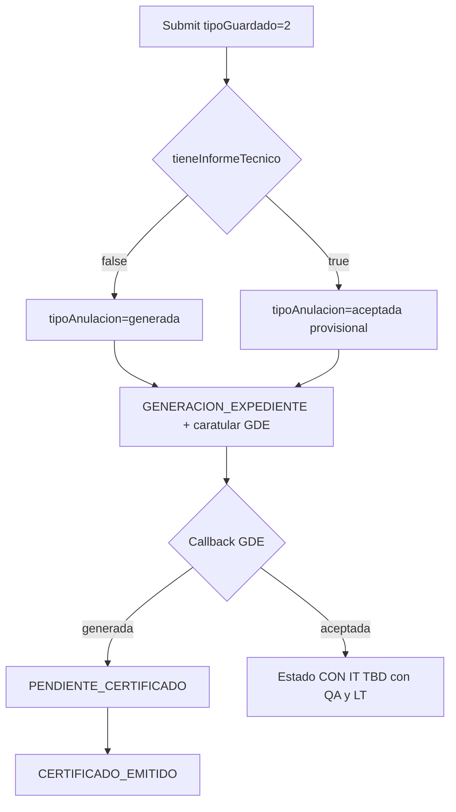

# Parte 2: Anula/Reemplaza sin Secretaría (reuso pipeline certificado)

## Alcance

**Incluye**
- [tramites-be](c:\Users\Usuario\Documents\Work\CTIT\tramites-be): create/update de anula y DrawBack actualizar; arranque GDE; bifurcación en callback GDE donde haga falta.
- [tramites-fe](c:\Users\Usuario\Documents\Work\CTIT\tramites-fe): solo ajustes mínimos de UX/mensaje post-envío si el estado inicial ya no es Secretaría (Parte 1 del radio ya está).

**Fuera de alcance (explícito)**
- Cualquier cambio en [tramites-backoffice-fe](c:\Users\Usuario\Documents\Work\CTIT\tramites-backoffice-fe).
- Cambios en [tramite.entity.ts](c:\Users\Usuario\Documents\Work\CTIT\tramites-be\src\modules\tramites\entities\tramite.entity.ts) ligados a lo que consume el BO.
- Deprecar UI/EP de validación Secretaría en BO; [validar-anulaciones.handler.ts](c:\Users\Usuario\Documents\Work\CTIT\tramites-be\src\modules\tramites\commands\validar-anulaciones\validar-anulaciones.handler.ts) sigue para trámites legacy ya en cola.
- Renovaciones (`tipo=renueva`): siguen yendo a Secretaría.

## Decisión de estados

| Radio empresa | Equivalente histórico BO | `tipoAnulacion` (anula) | Tras callback GDE |
|---|---|---|---|
| No tiene IT | Generar certificado | `generada` | `PENDIENTE_CERTIFICADO` → … → `CERTIFICADO_EMITIDO` (**cerrado**) |
| Tiene IT | Requiere IT | `aceptada` (provisional) | **Pendiente de definición** — ver sección abajo |

“Inmediatamente Certificado Emitido” = **sin espera de Secretaría**; la emisión sigue el pipeline async GDE existente (no setear `CERTIFICADO_EMITIDO` en el `POST`).

### Estado CON IT — pendiente QA / LT (bloqueante)

Hoy hay dudas: la US habla de **“Pendiente de Validación (Ingeniero)”**, pero ese label **no existe** en el enum actual. Candidatos históricos (`HABILITADA_PARA_IT`, `IT_SOLICITADO`, estado nuevo + label) **no están cerrados**.

**Antes de implementar la rama con IT** hay que acordar con el equipo de **QA** y el **LT**:

1. ¿Reutilizar un estado existente (cuál) o crear uno nuevo?
2. ¿El label visible en FE empresa debe cambiar / agregarse?
3. ¿El camino técnico sigue siendo `tipoAnulacion=aceptada` + callback GDE actual, o otro arranque?

Hasta esa definición, la implementación puede avanzar el camino **sin IT** (kickoff `generada` + pipeline certificado) y dejar cableado el branch `tieneInformeTecnico=true` con el estado acordado una vez exista la decisión.

## Implementación BE

### 1. Extraer servicio de arranque post-decisión

Crear algo como `AnulacionExpedienteKickoffService` (nombre kebab/carpeta bajo `tramites/services/`) con la lógica hoy en `handleAceptarOGenerar` + `actualizarEstadoGeneracionExpediente`:

- Persistir `tipoAnulacion` (`generada` | `aceptada`).
- Si `generada`: copiar `fechaVencimiento` del certificado anulado (mismo código actual).
- Caratular GDE (CTIT/CTZF) + guardar `TramiteEvento` CARATULAR.
- `cambiarEstado(..., GENERACION_EXPEDIENTE)`.

Usarlo desde:
- Nuevo flujo en create/update anula.
- Refactor de `ValidarAnulacionesHandler` para no duplicar (legacy BO).

### 2. `AnularTramiteHandler` (POST `/tramites/anular`)

En [anular-tramite.handler.ts](c:\Users\Usuario\Documents\Work\CTIT\tramites-be\src\modules\tramites\commands\anular-tramite\anular-tramite.handler.ts), cuando `tipoGuardado === 2`:

- **Dejar de** setear `PENDIENTE_REVISION_SECRETARIA_COMERCIO`.
- Tras guardar `TramiteAnulado` + `tieneInformeTecnico`, invocar kickoff:
  - `false` → `generada` (cerrado)
  - `true` → `aceptada` **solo si QA/LT confirman** que el camino histórico “Requiere IT” aplica; si elijen otro estado/arranque, ajustar aquí
- Estado resultante inmediato: `GENERACION_EXPEDIENTE` (igual que hoy post-BO).
- `tipoGuardado === 1`: sigue `BORRADOR`; no GDE.

### 3. `UpdateTramiteHandler` (PATCH desde borrador anula)

En [update-tramite.handler.ts](c:\Users\Usuario\Documents\Work\CTIT\tramites-be\src\modules\tramites\commands\update-tramite\update-tramite.handler.ts):

- En `resolveEstadoFromTipoGuardado`: para `tipo === ANULA` + `tipoGuardado === 2` → `GENERACION_EXPEDIENTE` (no Secretaría). `RENUEVA` sin cambio.
- En `updateAnulacionIfNeeded` / al enviar: setear `tipoAnulacion` según `tieneInformeTecnico` **antes** del GDE (rama true sujeta a decisión QA/LT).
- `processGenerarExpediente` ya caratula en submit: alinear con el servicio compartido (evitar doble carátula / lógica divergente). Preferir delegar el kickoff GDE+estado al servicio y no caratular dos veces.

### 4. DrawBack actualizar (`ActualizarTramiteHandler`)

En [actualizar-tramite.handler.ts](c:\Users\Usuario\Documents\Work\CTIT\tramites-be\src\modules\tramites\commands\actualizar-tramite\actualizar-tramite.handler.ts):

Hoy `tipoGuardado === 2` + DRAWBACK → Secretaría y **no** caratula. Cambiar a:

- Siempre `GENERACION_EXPEDIENTE` en submit (sin Secretaría).
- Caratular GDE también para DRAWBACK (quitar el `if (tipoTramite !== DRAWBACK)` que saltea carátula en submit).
- Persistir `tieneInformeTecnico` (ya hecho).

### 5. Callback GDE — bifurcación DrawBack / `actualizado`

En [respuesta-transaccion.handler.ts](c:\Users\Usuario\Documents\Work\CTIT\tramites-be\src\modules\integraciones-tramites\commands\handlers\respuesta-transaccion.handler.ts), rama `tipo === 'actualizado'` (hoy siempre `PENDIENTE_CERTIFICADO`):

- Si `TramiteActualizado.tieneInformeTecnico === true` → **estado CON IT definido con QA/LT** (+ notificación coherente con ese estado).
- Si `false` / null (legacy) → mantener camino actual a `PENDIENTE_CERTIFICADO` / emisión.

La rama `tipo === 'anula'` con `tipoAnulacion=aceptada` hoy deja `HABILITADA_PARA_IT`; **solo se deja así o se cambia** cuando QA/LT cierren el mapeo de la US.

### 6. Tests

- Unit `AnularTramiteHandler`: `tipoGuardado=2` + flag false → `tipoAnulacion=generada` + `GENERACION_EXPEDIENTE` (mock GDE).
- Unit camino `true`: **después** de la definición QA/LT.
- Unit `UpdateTramiteHandler`: ANULA sin Secretaría; RENUEVA sigue Secretaría.
- Unit/servicio kickoff: `generada` copia vencimiento; carátula invocada.
- Callback `actualizado` con IT: assert del estado acordado.
- Extender e2e anular (o unit fuerte si e2e de entorno falla): submit sin Secretaría.

Validaciones por iteración (BE): `npm run lint`, `npm run check-naming-convention`, `npm run test:file -- <patrón>`.

## FE empresa (mínimo)

- Parte 1 ya envía `tieneInformeTecnico`.
- Revisar pantallas de éxito / “mis trámites” por si asumen `PENDIENTE_REVISION_SECRETARIA_COMERCIO` tras anula/actualizar; ajustar copy si hace falta.
- Labels del camino CON IT: **dependen de la definición QA/LT** (reuso de label existente vs texto nuevo).

## Fuera / no tocar

- `tramites-backoffice-fe`
- `tramite.entity.ts` (campos/lógica BO)
- Remoción de EP `validar-anulaciones` o colas BO
- Flujo renovar
